

  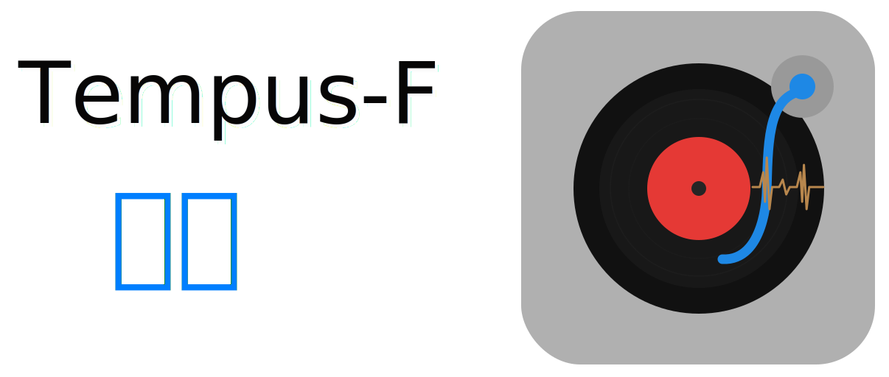

---

  <b>Access your music library on all your android devices</b>

    
    

[Changelog](CHANGELOG.md) | [Wiki](USAGE.md) | [Support](https://github.com/sffzh/tempus-f#Support)

    
    <!--  -->

**Tempus-F** is an open-source and lightweight music client for Subsonic / Navidrome, designed and built natively for Android. It provides a seamless and intuitive music streaming experience, allowing you to access and play your Subsonic music library directly from your Android device. 

Tempus-F does not rely on magic algorithms to decide what you should listen to. Instead, the interface is built around your listening history, randomness, and optionally integrates with services like Listenbrainz.org and Last.fm to personalize your music experience (These must be supported by your backend). 

_The project is a fork of [Tempus](https://github.com/eddyizm/tempus) (Which is a fork of [Tempo](https://github.com/CappielloAntonio/tempo))._

**If you find Tempus-F useful, please consider starring the project on GitHub. It would mean a lot to me and help promote the app to a wider audience.**

**Use the GitHub version of the app for full Android Auto and Chromecast support.**

### Releases  

Please note the two variants in the release assets include release/debug and 32/64 bit flavors.

`Tempus-F-tempus*` <- The github release with all the android auto/chromecast features 

`Tempus-F-degoogled*` <- The izzyOnDroid release that goes without any of the google stuff. Both 32/64bit apk's here on github for those who need a 32bit version.

## Features

- **Subsonic Integration**: Tempus-F seamlessly integrates with your Subsonic server, providing you with easy access to your entire music collection on the go.
- **Sleek and Intuitive UI**: Enjoy a clean and user-friendly interface designed to enhance your music listening experience, tailored to your preferences and listening history.
- **Browse and Search**: Easily navigate through your music library using various browsing and searching options, including artists, albums, genres, playlists, decades and more.
- **Streaming and Offline Mode**: Stream music directly from your Subsonic server. Offline mode is currently under active development and may have limitations when using multiple servers.
- **Playlist Management**: Create, edit, and manage playlists to curate your perfect music collection.
- **Gapless Playback**: Experience uninterrupted playback with gapless listening mode.
- **Chromecast Support**: Stream your music to Chromecast devices. The support is currently in a rudimentary state.*
- **Scrobbling Integration**: Optionally integrate Tempus-F with Last.fm or Listenbrainz.org to scrobble your played tracks, gather music insights, and further personalize your music recommendations, if supported by your Subsonic server.
- **Podcasts and Radio**: If your Subsonic server supports it, listen to podcasts and radio shows directly within Tempus-F, expanding your audio entertainment options.
- **Instant Mix**: Full refactor of instant mix function which leverages Subsonics similarSongs2 by artist/album and similar Songs endpoints to server a larger play queue more reliably.
- **Transcoding Support**: Activate transcoding of tracks on your Subsonic server, allowing you to set a transcoding profile for optimized streaming directly from the app. This feature requires support from your Subsonic server.
- **Android Auto Support**: Enjoy your favorite music on the go with full Android Auto integration, allowing you to seamlessly control and listen to your tracks directly from your mobile device while driving.* 
- **Multiple Libraries**: Tempus-F handles multi-library setups gracefully. They are displayed as Library folders.
- **Equalizer**: Option to use in app equalizer.
- **Widget**: New widget to keeping the basic controls on your screen at all times.
- **Available in 13 languages**: Currently in Chinese, French, German, Italian, Korean, Polish, Portuguese, Russion, Spanish and Turkish

 ** GitHub version only*

## Current Mainly Differences From Tempus

> The current version is functionally aligned with the official Tempus project version 4.9.1.
>
> except these changes:

- Optimized application performance to handle specific scenarios (such as playlists with a large number of entries).
- Expanded lyrics display area.
- Smooth scrolling of lyrics (while also improving performance).
- Supports displaying lyrics in two lines (with translation).
- Optimized display effects in landscape and split-screen modes.
- Optimized random playback logic.
- Significant optimizations were made to utilize more modern and performant code solutions.

> Further performance optimizations will be carried out.

## Screenshot

  <b>Light theme</b>

    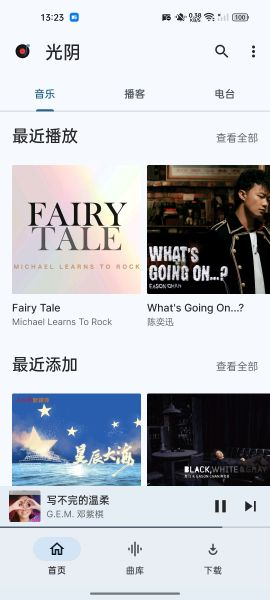
    
    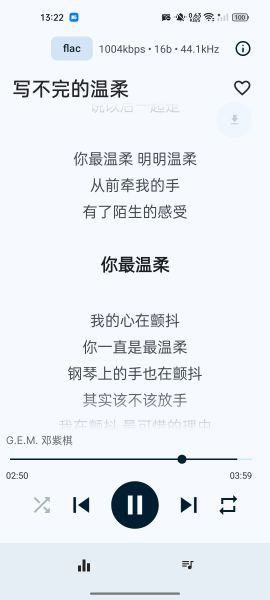
    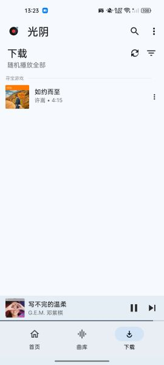
    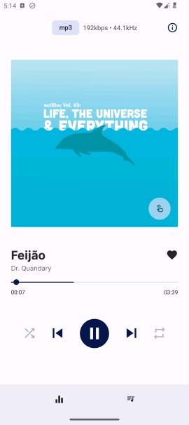
    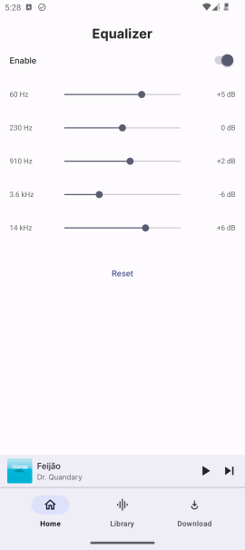
    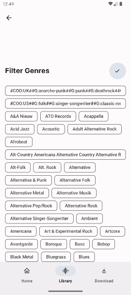
    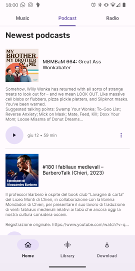

 

  <b>Dark theme</b>

    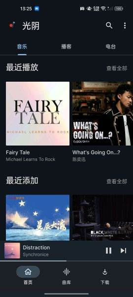
    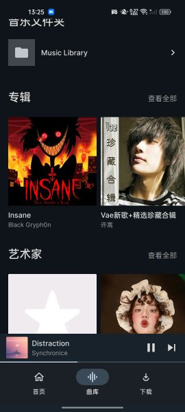
    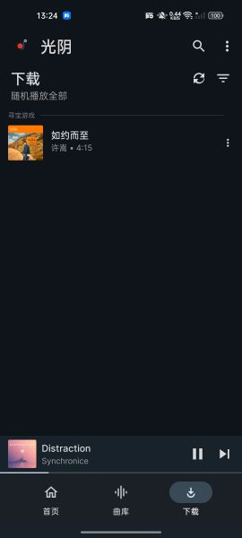
    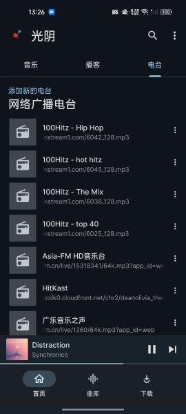
<!-- 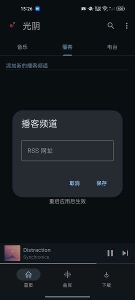 -->
    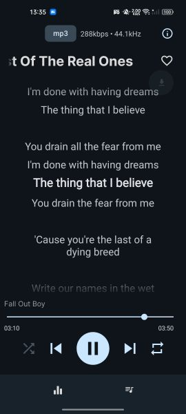
    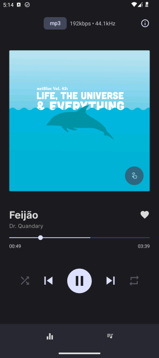
    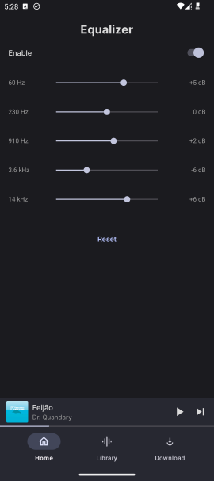
    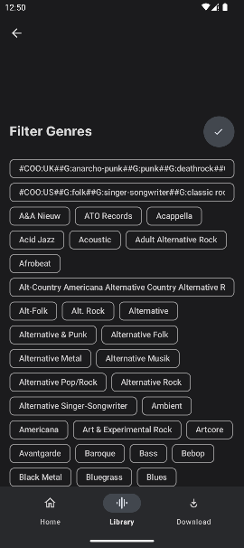

## Contributing

Please fork and open PR's against the development branch (dev_sffzh). Make sure your PR builds successfully. 

If there is an UI change, please include a before/after screenshot and a short video/gif if that helps elaborating the fix/feature in the PR. 

Currently there are no tests but I would love to start on some unit tests. 

Not a hard requirement but any new feature/change should ideally include an update to the nacent documention. 

*Special Thanks*  

## Donate

[**Buy me a coffee**](https://afdian.com/a/tempus-f)  
[在**爱发电**上赞助我](https://afdian.com/a/tempus-f)  

## License

Tempus-F is released under the [GNU General Public License v3.0](LICENSE). Feel free to modify, distribute, and use the app in accordance with the terms of the license. Contributions to the project are also welcome. 

## Credits

Thanks to the original repo/creator [eddyizm](https://github.com/eddyizm) (forked from v4.6.4)

And the original project Tempo, created by [CappielloAntonio](https://github.com/CappielloAntonio) (eddyizm/tempus forked from v3.9.0)

Special thanks to the Tempus project.